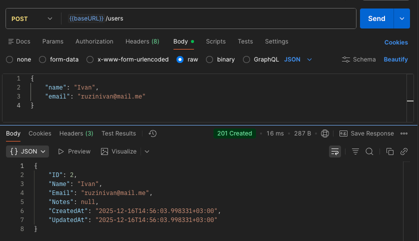
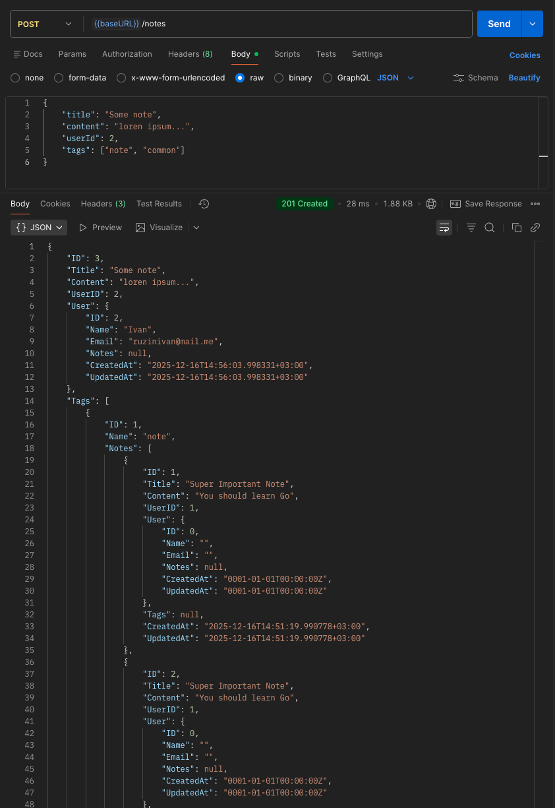
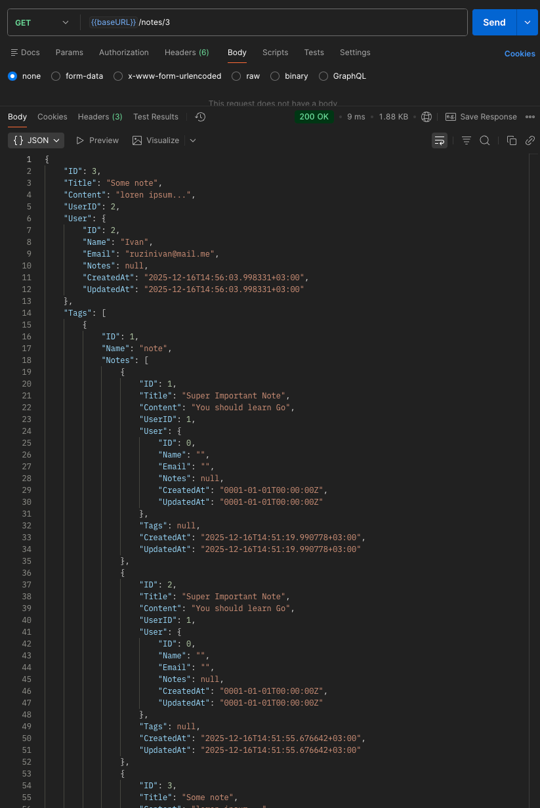
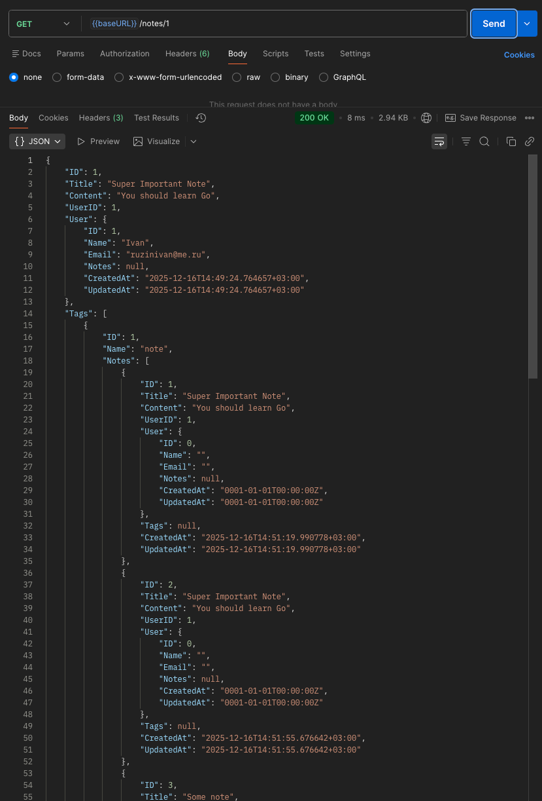

# Практическая работа №6
## Использование ORM (GORM). Модели, миграции и связи между таблицами.
## Рузин Иван Александрович ЭФМО-01-25


## Окружение

- Go: 1.25.1
- PostgreSQL: 14
- ОС: macOS 26.2
- DB_DSN="host=127.0.0.1 user=postgres password=12345678 dbname=todo port=5432 sslmode=disable"
---

### Зачем нужен ORM
ORM удобен, когда хочется описывать структуру данных через модели и работать с ними как с объектами, а не вручную собирать SQL-строки. Дополнительно это снижает риск ошибок при подстановке параметров и упрощает поддержку схемы БД за счёт миграций.
### Чем помог GORM
- создание/обновление таблиц на старте (через миграции)
- типовые операции чтения/создания/обновления/удаления через методы GORM 
- фильтрация/сортировка запросов без «ручного» SQL 
- загрузка связанных сущностей через Preload (в том числе цепочкой)

## Скриншоты

- Health check


- Новый пользователь



- Новая заметка



- Получение заметки по id



---

## Проблемы возникшие при выполнении работы
### В ответе на запрос заметки поле notes возвращало null
Причина оказалась в том, что часть связанных данных не подгружалась автоматически. Исправлено явной загрузкой зависимостей через вложенный Preload.
``` go
if err := h.db.Preload("User").Preload("Tags.Notes").First(&note, id).Error; err != nil {
		writeErr(w, http.StatusNotFound, "note not found")
		return
	}
```

